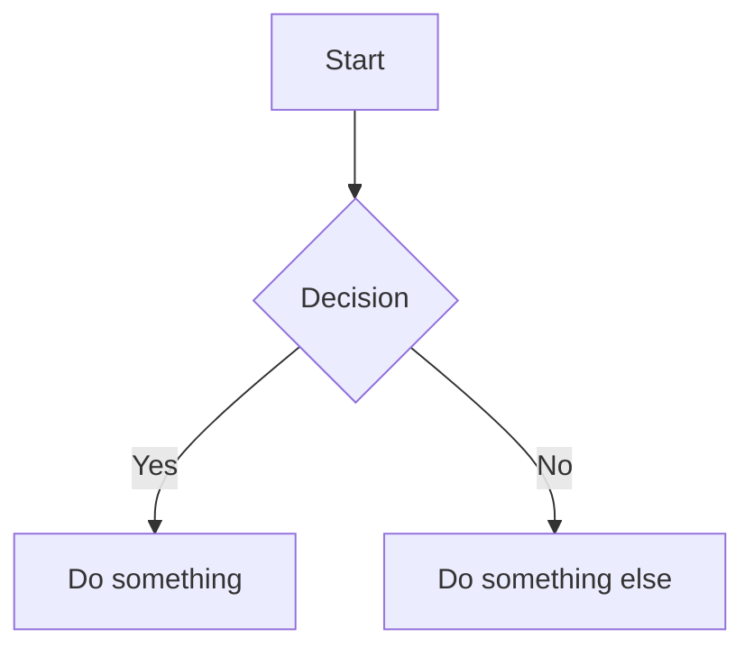
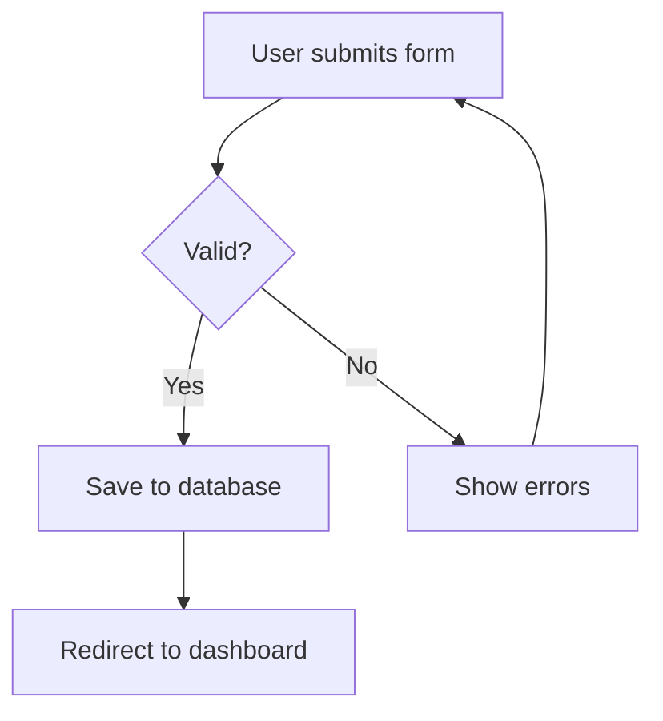
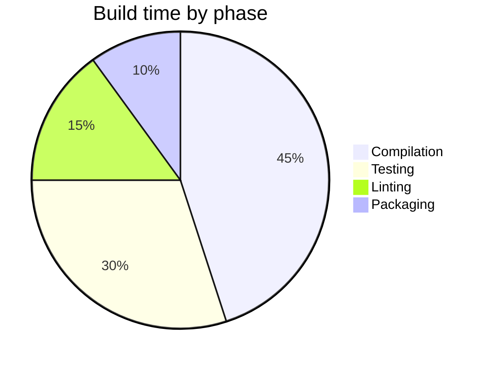

# Charts in Markdown Files

When creating charts or diagrams in markdown files, follow these rules:

## Use Mermaid syntax

Always use [Mermaid](https://mermaid.js.org/) fenced code blocks for charts and diagrams. Do not use ASCII art.

~~~markdown

~~~

Mermaid supports many diagram types including flowcharts, sequence diagrams, class diagrams, state diagrams, ER diagrams, Gantt charts, pie charts, and more. Choose the type that best represents the data.

## Always include a text alternative

Every mermaid diagram **must** be accompanied by a text description that conveys the same information. This is essential for accessibility -- screen reader users cannot interpret mermaid diagrams.

The text alternative should:

- Appear immediately before or after the mermaid block
- Present the same data and relationships, not just a summary
- Use headings, lists, or tables as appropriate for the data
- Be detailed enough that a reader using only the text alternative would have equivalent understanding

### Example

~~~markdown

~~~

**Form submission flow (text description):**

1. User submits the form.
2. The input is validated.
   - If valid: the data is saved to the database, then the user is redirected to the dashboard.
   - If invalid: validation errors are shown, and the user is returned to the form to resubmit.

### Example with data

~~~markdown

~~~

**Build time by phase (text description):**

| Phase       | Percentage |
|-------------|------------|
| Compilation | 45%        |
| Testing     | 30%        |
| Linting     | 15%        |
| Packaging   | 10%        |
